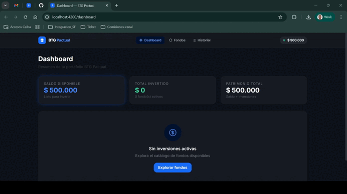

# BTG Funds

Aplicación web desarrollada en Angular para la gestión de fondos FPV/FIC en el contexto de la prueba técnica de Front-End.

El objetivo de la solución es permitir que un usuario único consulte el catálogo de fondos disponibles, se suscriba validando saldo y monto mínimo, cancele participaciones activas y revise el historial de transacciones con una experiencia clara y responsiva.

## Demo visual

<p align="center">
  
</p>

## Alcance funcional

- Visualización de fondos disponibles.
- Suscripción a fondos con validación de monto mínimo y saldo disponible.
- Cancelación de participaciones activas con reintegro al saldo principal.
- Historial cronológico de suscripciones y cancelaciones.
- Selección de método de notificación al suscribirse: email o SMS.
- Feedback visual con skeletons, estados de carga y toasts.

## Stack técnico

- Angular 18 con componentes standalone.
- TypeScript.
- Angular Router para navegación.
- Signals para manejo de estado local de aplicación.
- RxJS para simulación de operaciones asíncronas.
- Tailwind CSS para estilos utilitarios y layout responsivo.

## Requisitos previos

- Node.js 18 o superior.
- npm 9 o superior.

## Instalación y ejecución

1. Clonar el repositorio.
2. Instalar dependencias.
3. Levantar el servidor de desarrollo.

```bash
npm install
npm start
```

La aplicación quedará disponible en la URL que entregue Angular CLI, normalmente:

```bash
http://localhost:4200/
```

## Scripts disponibles

```bash
npm start   # servidor de desarrollo
npm run build   # build de producción
npm run watch   # build en modo watch
npm test   # pruebas unitarias con Jest + Angular Testing Library
npm run test:coverage   # reporte de cobertura
```

## Datos base de la prueba

La aplicación asume un único usuario con saldo inicial de COP $500.000.

Fondos configurados:

| ID | Nombre | Monto mínimo | Categoría |
| --- | --- | ---: | --- |
| FPV_BTG_PACTUAL_RECAUDADORA | FPV BTG Pactual Recaudadora | COP $75.000 | FPV |
| FPV_BTG_PACTUAL_ECOPETROL | FPV BTG Pactual Ecopetrol | COP $125.000 | FPV |
| DEUDAPRIVADA | FPV BTG Pactual Deuda Privada | COP $50.000 | FIC |
| FDO-ACCIONES | FIC BTG Pactual Renta Variable | COP $250.000 | FIC |
| FPV_BTG_PACTUAL_DINAMICA | FPV BTG Pactual Dinámica | COP $100.000 | FPV |

## Navegación

- `/dashboard`: resumen de saldo, patrimonio y fondos activos.
- `/funds`: catálogo de fondos disponibles y gestión de suscripciones activas.
- `/transactions`: historial de transacciones.

## Arquitectura del proyecto

```text
src/app/
  core/
    models/      modelos de dominio
    pipes/       utilidades de presentación
    services/    estado y lógica de negocio
  features/
    dashboard/           vista de resumen
    fund-list/           catálogo y cancelaciones
    subscription-modal/  flujo de suscripción
    transaction-history/ historial de movimientos
  shared/
    components/  componentes reutilizables
    services/    utilidades compartidas
```

### Decisiones de implementación

- El estado principal de la aplicación se centraliza en `FundService` usando Angular Signals.
- La simulación de backend se consume desde una capa mock explícita con `HttpClient` y archivos locales, evitando acoplar el catálogo directamente al servicio de dominio.
- Las validaciones críticas se implementan en dos niveles:
  - UI: validaciones reactivas de formulario.
  - Dominio: validaciones en el servicio antes de mutar estado.
- El formato monetario se centraliza en un pipe dedicado para mantener consistencia visual en toda la aplicación.

## Tradeoffs y decisiones

- Se eligió un mock local con `HttpClient` sobre `json-server` para mantener la prueba autocontenida y ejecutable sin procesos adicionales, pero conservando una separación clara entre acceso a datos y lógica de negocio.
- El catálogo permanece completo y visible incluso cuando un fondo ya está suscrito. La tarjeta cambia de estado visual a `Activo` o `Ya suscrito` para evitar ambigüedad y mantener trazabilidad respecto a los 5 fondos del enunciado.
- `FundService` concentra estado y reglas de negocio, mientras que `MockFundsApiService` encapsula el contrato de la API simulada. Esa división mantiene las decisiones de dominio aisladas del detalle de transporte.

## Flujo funcional relevante

### Suscripción

Al intentar suscribirse a un fondo, la aplicación valida:

- que el monto ingresado sea mayor o igual al monto mínimo del fondo,
- que el usuario tenga saldo suficiente,
- que la operación refleje el método de notificación seleccionado.

Si la operación es exitosa:

- se descuenta el valor del saldo disponible,
- se registra la suscripción activa,
- se agrega una transacción al historial,
- se informa el resultado mediante un toast.

### Cancelación

Al cancelar una suscripción activa:

- se elimina la participación del listado de fondos activos,
- se reintegra el valor invertido al saldo principal,
- se registra la cancelación en el historial,
- se muestra feedback visual durante el procesamiento.

## Simulación de API

La aplicación consume un mock API explícito separado de la lógica de negocio.

- El catálogo de fondos se sirve desde [public/mock-api/funds.json](public/mock-api/funds.json).
- La capa de acceso mock está encapsulada en `MockFundsApiService`.
- `FundService` conserva las reglas de negocio y el estado de la aplicación, pero ya no define el catálogo embebido dentro del servicio.

Las operaciones de suscripción y cancelación siguen simuladas localmente porque la prueba no requiere backend real, pero ahora pasan por una capa API mock dedicada para mantener una separación más clara entre acceso a datos y dominio.

## Build de producción

Para generar el build optimizado:

```bash
npm run build
```

La salida se genera en:

```text
dist/btg-funds
```

## Estado actual y consideraciones

- La aplicación está enfocada en un escenario de usuario único, sin autenticación.
- La persistencia es en memoria; al recargar la página se reinicia el estado.
- Se incluyeron pruebas unitarias base de componentes con Jest y Angular Testing Library.
- No se implementa backend, despliegue ni integración con proveedores reales de mensajería.

## Criterios de calidad aplicados

- Separación clara entre presentación, estado y reglas de negocio.
- Componentes standalone y rutas lazy para mantener bajo acoplamiento.
- Validaciones explícitas en UI y servicio.
- Feedback visual en operaciones sensibles.
- Diseño adaptable para móvil, tablet y desktop con ajustes específicos por vista.
